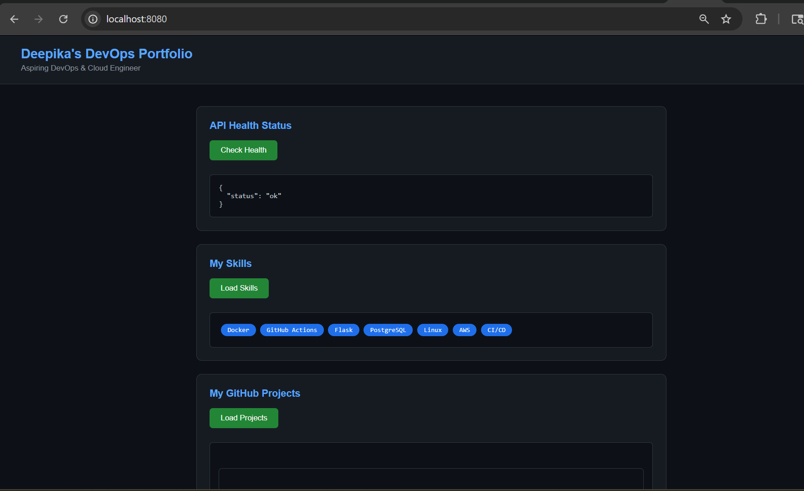
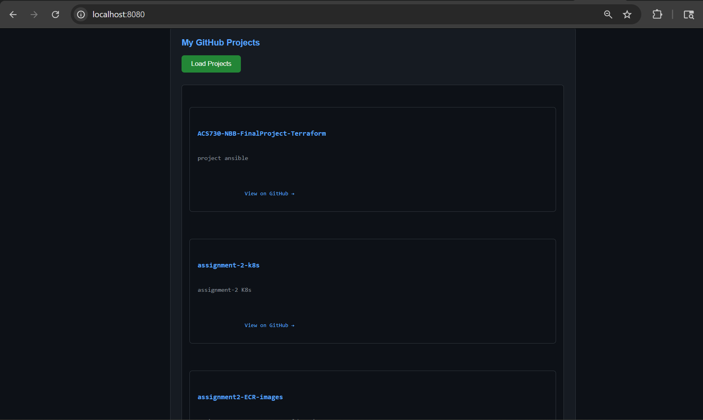

# Multi-Service DevOps Portfolio App

A 3-tier application built with Flask, PostgreSQL, and nginx — 
all orchestrated with Docker Compose. Displays my live GitHub 
projects and skills via a personal portfolio API.

## Screenshot

### Health Check & Skills


### GitHub Projects


## Architecture
```
Browser (port 8080)
        ↓
nginx (reverse proxy)
        ↓
Flask Backend API (port 5000)
        ↓
GitHub API + PostgreSQL Database
```

## Tech Stack

- **Flask** — REST API backend
- **nginx** — reverse proxy + static file server
- **PostgreSQL** — persistent database
- **Docker Compose** — container orchestration
- **GitHub API** — live project data

## API Endpoints

| Endpoint | Description |
|---|---|
| `/api/health` | Health check |
| `/api/projects` | Live GitHub repos |
| `/api/skills` | My DevOps skills |

## How to Run

**Clone the repo:**
```bash
git clone https://github.com/deepikapaneer/docker-multiservice.git
cd docker-multiservice
```

**Start all containers:**
```bash
docker compose up --build
```

**Visit in browser:**
```
http://localhost:8080
```

## What Each Container Does

| Container | Role | Port |
|---|---|---|
| `frontend` | nginx serves HTML + proxies API calls | 8080 |
| `backend` | Flask REST API + GitHub API integration | 5000 |
| `db` | PostgreSQL stores skills data | 5432 |

## Key Concepts Learned

- Multi-container orchestration with Docker Compose
- nginx reverse proxy configuration
- Container-to-container networking
- CORS handling between services
- Persistent data with Docker volumes
- Live API integration with GitHub API

## Customize for Your Own Portfolio   ← ADD HERE

This project is reusable! To make it your own:

1. Open `backend/app.py`
2. Change this one line:
```python
GITHUB_USERNAME = "deepikapaneer"  # replace with your GitHub username
```
3. Run `docker compose up --build`
4. Your own GitHub projects will appear automatically!

> All data is pulled live from the public GitHub API —
> only your public repositories are displayed.
> Private repos are never exposed.

## Project Status

✅ All 3 containers running
✅ nginx reverse proxy working
✅ Live GitHub projects loading
✅ PostgreSQL database connected